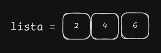
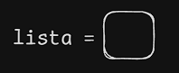
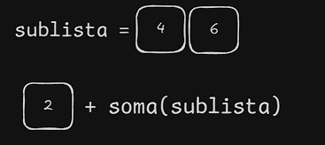
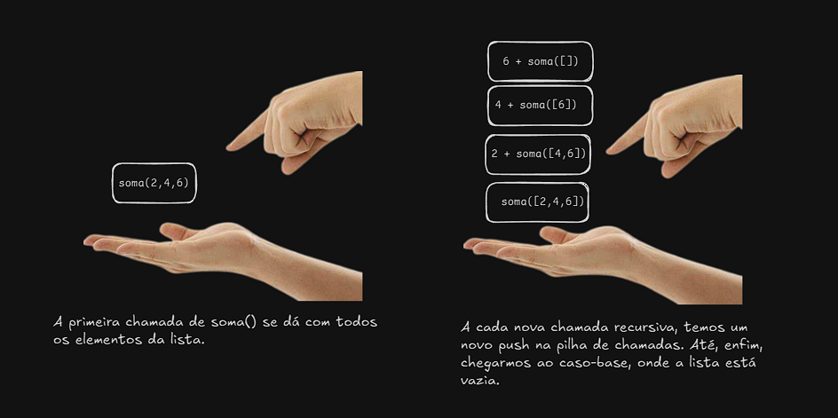
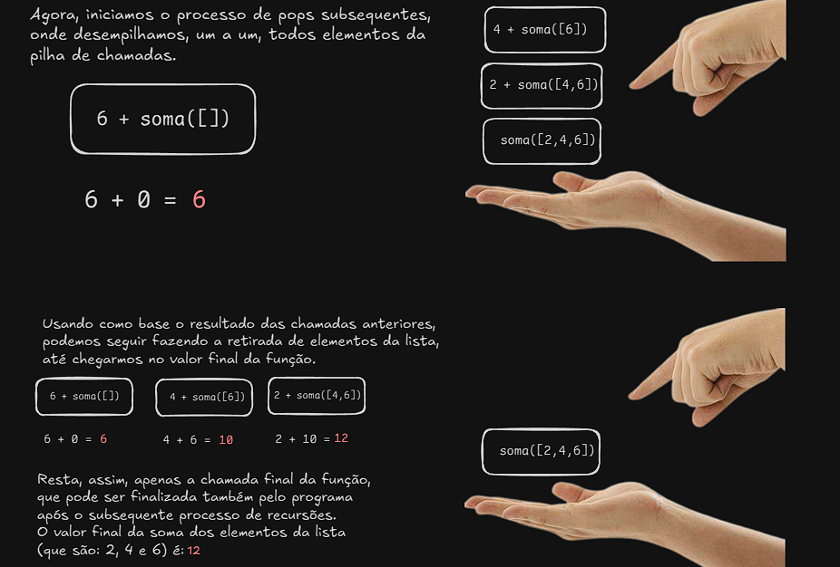

# Documentando o código...
No arquivo [`dc_recursao.java`](../dc_recursao.javap) temos um exemplo da técnica de resolução de problemas dividir para conquistar, a seguir irei explicar o problema que iremos resolver, os passos tomados para que pudéssemos abordá-lo e detalharei sua resolução final. No entanto, antes disso, precisamos aprender o que é essa técnica e qual a sua usabilidade.

**Nota:** O conteúdo desse texto se baseia diretamente em um exemplo dado no livro "Entendendo Algoritmos", é uma leitura extremamente recomendada.

## O que é a técnica dividir para conquistar?
É um paradigma de design de algoritmos que resolve problemas complexos dividindo-os em subproblemas menores e mais simples, resolvendo esses subproblemas **recursivamente**, e então combinando suas soluções para obter a solução do problema original. Para resolvermos um problema utilizando DC, precisamos seguir os seguintes passos:

1. Descubra o caso-base, que deve ser o caso mais simples possível.
2. Divida ou diminua o seu problema até que ele se torne o caso-base.

Essa técnica é utilizada em diversos algoritmos, como a busca binária, o *quicksort*, etc.

## Ok, mas qual é o problema?
É um problema simples: temos uma lista (ou um vetor, utilizamos listas apenas para simplificar a implementação) contendo n valores e queremos retornar sua soma. Para isso, poderíamos utilizar um laço para facilmente chegarmos a um resultado satisfatório, no entanto, para colocarmos em prática a técnica dividir para conquistar, utilizaremos a recursão.



## E agora? Como o resolvemos utilizando DC?
Como mencionado anteriormente, precisamos de duas etapas para resolver um problema com a técnica dividir para conquistar: descobrir o caso-base e diminuir o nosso problema até que ele se torne esse caso. Com isso em mente, sabemos também que uma recursão também tem dois casos pré-definidos: o recursivo (que perpetua a repetição da função) e o base (que encerra a função e retorna os valores gerados a partir da pilha para o usuário).

No nosso exemplo, qual seria o caso-base?
**R:** O caso mais simples possível é quando a lista está vazia ou contém apenas um elemento. Se a lista estiver vazia, a soma é 0. Se houver apenas um elemento, a soma é o próprio elemento.

- Caso-base:


Respondida essa pergunta, precisamos pensar em como gerar um caso recursivo para subdividir o problema até que alcançemos o caso-base. Para isso, podemos reduzir o tamanho da nossa lista, até que ela contenha um único elemento ou fique vazia. A cada passo da recursão, pegamos um elemento da lista (por exemplo, o primeiro) e somamos ao resultado da soma recursiva dos elementos restantes (que será a chamada da função `soma()` descrita a seguir passando como parâmetro uma sublista da lista original).

- Caso recursivo:


## Resolução final (em Java)

A seguir, apresentamos a implementação final da solução usando Java, baseada na técnica de dividir para conquistar:
```java
    public static int soma(List<Integer> lista){

        if(lista.isEmpty()){ // Caso-base: Tamanho zero
            return 0;
        }

        List<Integer> sublista = lista.subList(1, lista.size());

        // Linhas 16-21 servem apenas para debug do método e podem ser ignoradas
        System.out.println("Valor do primeiro elemento de 'lista': " + lista.get(0));
        System.out.println("Valor dos elementos restantes de 'lista': ");
        for(int i = 0; i<lista.subList(1, lista.size()).size(); i++){
            System.out.println(sublista.get(i));
        }
        System.out.println();

        return lista.get(0) + soma(sublista); // Caso-recursivo: Passo uma sublista como parâmetro que vai do segundo elemento até o último
    }
```

### Explicação do Código

**Função `soma(List<Integer> lista)`**: Esta função implementa a técnica de dividir para conquistar para somar os elementos de uma lista de inteiros.

#### Estrutura da Função:

1. **Caso Base:** A função verifica se a lista está vazia utilizando o método `isEmpty()`. Se estiver vazia, retorna 0, pois não há elementos para somar.

```java
if(lista.isEmpty()){
    return 0;
}
```

2. **Preparação para o Caso Recursivo:** A função cria uma sublista a partir do segundo elemento até o último, utilizando `subList(1, lista.size())`. Essa sublista é passada na chamada recursiva.

```java
List<Integer> sublista = lista.subList(1, lista.size());
```

3. **Código de Debug:** As linhas de debug (16-21) exibem o valor do primeiro elemento da lista e os elementos da sublista. Essa parte pode ser ignorada para o entendimento da lógica principal.

```java
System.out.println("Valor do primeiro elemento de 'lista': " + lista.get(0));
System.out.println("Valor dos elementos restantes de 'lista': ");
for(int i = 0; i < lista.subList(1, lista.size()).size(); i++){
    System.out.println(sublista.get(i));
}
System.out.println();
```

4. **Caso Recursivo:** A função retorna o primeiro elemento da lista somado ao resultado da chamada recursiva com a sublista. Este passo reduz o problema ao remover o primeiro elemento da lista a cada chamada até que a lista esteja vazia (caso base).

```java
return lista.get(0) + soma(sublista);
```

### E a pilha de chamadas?
Caso não saiba, sempre que usamos recursão trabalhamos com um empilhamento de chamadas de função. Tratarei brevemente desse conceito agora, para que eu possa explicar como ele se aplica nesse exemplo.

Imagine que você está construindo uma torre de blocos onde cada bloco é colocado em cima do bloco anterior. Este processo pode ser comparado ao conceito de pilha em programação.
(*Push*: adição de elementos) -> Cada vez que você adiciona um bloco à torre, você coloca o novo bloco em cima do bloco que já está lá. Isso é como empilhar chamadas de função na memória, onde cada nova chamada de função é colocada em cima da anterior.
(*Pop*: retirada de elementos) -> Quando você decide remover um bloco da torre, você sempre retira o bloco do topo. Assim, o bloco que estava mais recentemente no topo é o primeiro a ser removido. Isso é semelhante ao desempilhamento de chamadas de função, onde a função que foi chamada mais recentemente é a primeira a retornar seu valor.

#### E no exemplo original (da soma)?
No exemplo original, temos chamadas subsequentes da função `soma()` de uma lista com número de elementos cada vez menor, até não restar nenhum. Nesse processo, há um constante empilhamento de novas chamadas na pilha, até que cheguemos ao cenário do caso-base.


Após construirmos a pilha de chamadas, precisamos desempilhá-la até retornarmos à função que originou as tantas chamadas recursivas que estamos lidando.

